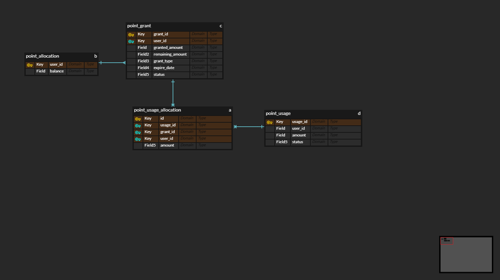

---

# Point Service (Payments Domain)

## 1. 프로젝트 개요

```
* 필요 기능 : 적립, 적립취소, 사용, 사용취소
    1. 적립
        1. 1회 적립가능 포인트는 1포인트 이상, 10만포인트 이하로 가능하며 1회 최대 적립가능 포인트는 하드코딩이 아닌 방법으로 제어할수 있어야 한다.
        2. 개인별로 보유 가능한 무료포인트의 최대금액 제한이 존재하며, 하드코딩이 아닌 별도의 방법으로 변경할 수 있어야 한다.
        3. 특정 시점에 적립된 포인트는 1원단위까지 어떤 주문에서 사용되었는지 추적할수 있어야 한다.
        4. 포인트 적립은 관리자가 수기로 지급할 수 있으며, 수기지급한 포인트는 다른 적립과 구분되어 식별할 수 있어야 한다.
        5. 모든 포인트는 만료일이 존재하며, 최소 1일이상 최대 5년 미만의 만료일을 부여할 수 있다. (기본 365일)
    2. 적립 취소
        1. 특정 적립행위에서 적립한 금액만큼 취소 가능하며, 적립한 금액중 일부가 사용된 경우라면 적립 취소 될 수 없다.
    3. 사용
        1. 주문시에만 포인트를 사용할 수 있다고 가정한다.
        2. 포인트 사용시에는 주문번호를 함께 기록하여 어떤 주문에서 얼마의 포인트를 사용했는지 식별할 수 있어야 한다.
        3. 포인트 사용시에는 관리자가 수기 지급한 포인트가 우선 사용되어야 하며, 만료일이 짧게 남은 순서로 사용해야 한다.
    4. 사용 취소
        1. 사용한 금액중 전제 또는 일부를 사용취소 할수 있다.
        2. 사용취소 시점에 이미 만료된 포인를 사용취소 해야 한다면 그 금액만큼 신규적립 처리 한다.
```

---


## 2. 기술 스택

```
- Java 21
- springboot 3.2.5
- Spring Web Web
- H2 Database SQL
- Gradle
- Spring Data JPA SQL
- Lombok Developer Tools
```

---

## 3. 패키지 구조

```
com.payment.point
├─ api
│  ├─ controller
│  │  ├─ PointGrantController
│  │  └─ PointUsageController
│  ├─ request
│  │  ├─ GrantPointRequest
│  │  ├─ CancelGrantRequest
│  │  ├─ UsePointRequest
│  │  └─ CancelUsageRequest
│  └─ response
│     ├─ PointGrantResponse
│     └─ PointUsageResponse
│
├─ application
│  └─ service
│     └── PointService
│
├─ domain
│  ├─ allocation
│  │  ├─ PointAllocation
│  │  └─ PointUsageAllocation
│  ├─ grant
│  │  ├─ PointGrant
│  │  ├─ PointGrantStatus
│  │  └─ PointGrantType
│  ├─ policy
│  │  ├─ PointPolicyReader
│  │  ├─ PointPolicyType
│  │  └─ PointPolicyValidator
│  └─ usage
│     ├─ PointUsage
│     └─ PointUsageStatus
│
└─ infrastructure
   └─ persistence
      ├─ allocation
      │  ├── PointAllocationEntity
      │  ├── PointAllocationRepository
      │  ├── PointUsageAllocationEntity
      │  └── PointUsageAllocationRepository
      ├─ grant
      │  ├── PointGrantEntity
      │  └── PointGrantRepository
      ├─ policy
      │  ├── PointPolicyEntity
      │  └── PointPolicyRepository
      └─ usage
         ├── PointUsageEntity
         └── PointUsageRepository
```

---

## 4. ERD



---

## 빌드 및 실행 방법

```
# 프로젝트 빌드 (터미널)
./gradlew clean build

# 애플리케이션 실행 (터미널)
java -jar build/libs/point-0.0.1-SNAPSHOT.jar

브라우저 http://localhost:8080/ 접속시 "Point API Start" 문구 확인

## 포인트 적립 API 확인
curl -X POST http://localhost:8080/points/grants \
  -H "Content-Type: application/json" \
  -d '{
    "userId": 1,
    "amount": 1000,
    "grantType": "AUTO"
  }'

## 포인트 적립 취소(전액취소) API 확인
curl -X POST http://localhost:8080/points/grants/1/cancel \
  -H "Content-Type: application/json" \
  -d '{
    "reason": "grant cancel"
  }'

## 포인트 사용 API 확인
curl -X POST http://localhost:8080/points/usages \
  -H "Content-Type: application/json" \
  -d '{
    "userId": 1,
    "amount": 300,
    "orderId": 1001
  }'

## 포인트 사용 취소
curl -X POST http://localhost:8080/points/usages/1/cancel \
  -H "Content-Type: application/json" \
  -d '{
    "cancelAmount": 300,
    "orderId": 1001
  }'


## 예시
# 1. 1000원 적립한다 (총 잔액 0 -> 1000 원)
curl -X POST http://localhost:8080/points/grants \
  -H "Content-Type: application/json" \
  -d '{
    "userId": 2,
    "amount": 1000,
    "grantType": "AUTO"
  }'

# 2. 500원 적립한다 (총 잔액 1000 -> 1500 원)
curl -X POST http://localhost:8080/points/grants \
  -H "Content-Type: application/json" \
  -d '{
    "userId": 2,
    "amount": 500,
    "grantType": "AUTO"
  }'
  
# 3. 주문번호 A1234 에서 1200원 사용한다 (총 잔액 1500 -> 300 원)
curl -X POST http://localhost:8080/points/usages \
  -H "Content-Type: application/json" \
  -d '{
    "userId": 2,
    "amount": 1200,
    "orderId": 1234
  }'

# 4. A의 적립이 만료되었다

# 5. C의 사용금액 1200원 중 1100원을 부분 사용취소 한다 (총 잔액 300 -> 1400 원)
curl -X POST http://localhost:8080/points/usages/2/cancel \
  -H "Content-Type: application/json" \
  -d '{
    "cancelAmount": 1100,
    "orderId": 1234
  }'


참고
- JDK 21 이상
- Gradle Wrapper 포함 (프로젝트 내 `gradlew` 사용)
- 기본 DB: H2 메모리 DB 사용 (별도 설정 불필요)
- 실행 후 API 문서는 http://localhost:8080/swagger-ui.html 에서 확인 가능
```


## 도메인 모델링 설명

```
엔티티	설명
PointAllocation	        사용자별 총 포인트 잔액
PointGrant	        포인트 적립 단위 (출처, 만료일 포함)
PointUsage	        포인트 사용 내역 (주문 단위)
PointUsageAllocation	특정 사용이 어떤 적립에서 얼마를 사용했는지에 대한 매핑
PointPolicy	        정책 값 (최대 적립/보유 한도, 만료일 등)
```

## etc

```
* 트랜잭션 및 동시성 처리
- 포인트 잔액 및 적립/사용 단위에 대해 Pessimistic Lock 적용
- 동시 요청 시 포인트 초과 사용 방지
- 모든 주요 유스케이스는 단일 트랜잭션으로 처리

* API 예시
포인트 적립
- POST /points/grants
포인트 적립 취소
- POST /points/grants/{grantId}/cancel
포인트 사용
- POST /points/usages
포인트 사용 취소
- POST /points/usages/{usageId}/cancel
```